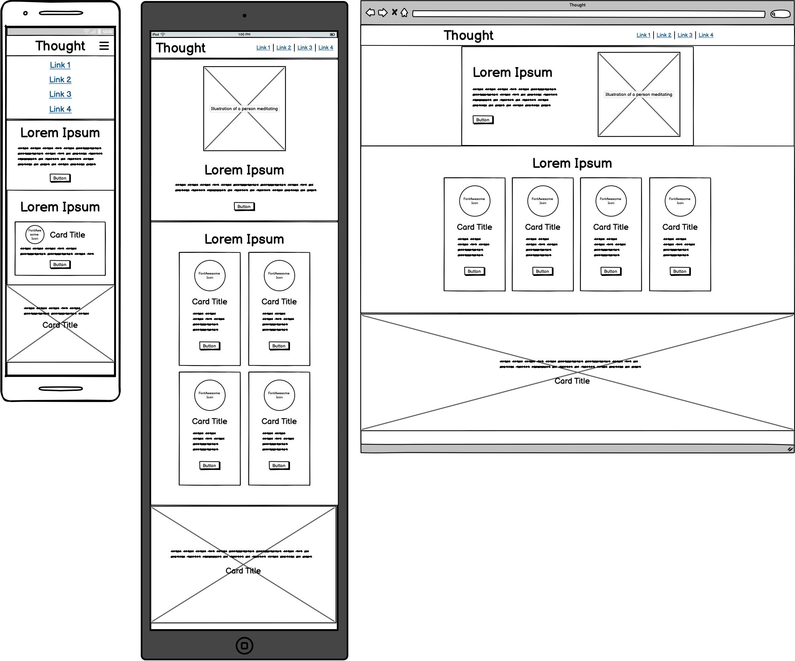

# Thought

## Overview

### Purpose

Thought is an organisation concerned with mental health. The main goal of its website is to provide information on how to maintain good mental health which its users can consume to become informed on the subject.

### Target Audience

Thought’s target audience is those who have an interest in mental health and thus can support many different types of users. The website could be used to support your own mental health, shared with those who are struggling with their mental health or be used to recognise poor mental health in the future.

## User Stories

### Must-Have User Stories

- **User Story 1:** As someone with poor mental health, I don't want to feel more overwhelmed than I already do by accessing the website so that I can ensure that I digest the content fully and use it to immediately calm down.

  **Acceptance Criteria:**

  - Layout that prioritises access to vital information for relaxing.
  - Neutral and calm colours that are sparingly used.
  - Clear sans-serif font face to ensure readability for all users.

- **User Story 2:** As a person who is interested in mental health, I want to read further into how I can optimise my mental health beyond the crisis-oriented content so I can ensure the stability of my mental health in the long term.

  **Acceptance Criteria:**

  - Provide links to long form content for those who wish to educate themselves further.
  - All advice should be referenced.

## Design Decisions

### Wireframes

#### Font

The font I chose was Inter. I decided to use only one font for this project because I felt that I could create enough variations using different sizes and weights to instil a hierarchy. Inter seemed a particularly compelling choice because of its nature as a sans-serif font; I felt this was particularly important because it’s easily legible for those who have vision problems or dyslexia as mental health can affect anyone. I also feel that Inter is a very neutral font and doesn’t have an overbearing personality which makes it very appropriate for this context as the font is solely being used as a vehicle to transfer information and mental health.

#### Colour Scheme

I used an off the shelf colour scheme from the website Open Colour and chose a purple theme as I found this to be calming, I took into consideration the colour contrast and tested this against the background using http://colourcontrast.cc

### Accessibility Considerations

To ensure accessibility on the website I used alt text on the images I and aria attributes, I also used colours with an appropriate contrast to retain readability, and my choice of font was also chosen with accessibility in mind.

## AI Tools Usage

### ChatGPT

ChatGPT was used to generate the paragraphs of copy on the website, it was very successful at achieving this after refining the prompt I used to be more specific as initially it was writing copy that was too long and not in a paragraph format.

## Testing and Validation

### Testing Results

I used the development tools on Firefox to test the responsiveness of the website throughout it's development. It was very effective at highlighting problems early on in the project.

## Deployment

### Deployment Process

I deployed this website using GitHub Pages by enabling it's functionality in the settings of the repository and selecting the main branch.

## Reflection on Development Process

### Successes

The project is responsive on all sizes of display and for the content I have produced I am proud.

### Challenges

By doing this project I have come to the realisation that I do not enjoy using Bootstrap and would prefer to write pure CSS as I wasted a large portion of time trying to implement the design in Bootstrap when doing so in pure CSS would have been easier.

## Code Attribution

[Love Rosie](https://github.com/Russlyman/love-rosie)

[Bootstrap 5 Docs](https://getbootstrap.com/docs/5.3/getting-started/introduction/)

[unDraw Illustrations](https://undraw.co/)

[openColor](https://yeun.github.io/open-color/)

## Future Improvements

Future improvements that could be made to the website include the creation of extra pages that link to the existing links to the website, which could consist of a contact form, a blog and animations to create interest and provide further depth to the website.
